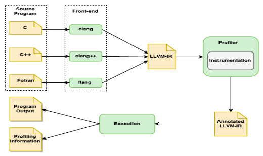
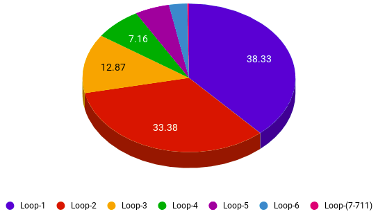
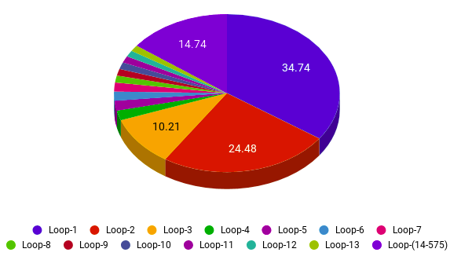
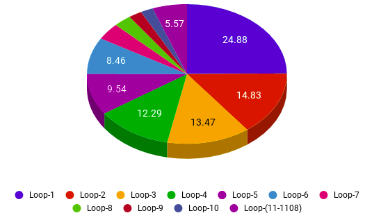
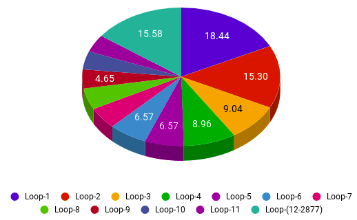
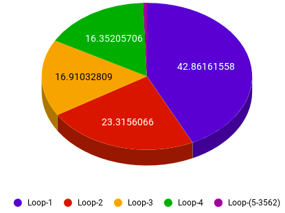

# LLVM-Loop-Profiler
LLVM Loop profiler works for LLVM-IR, which gives loop-based run-time information mainly execution time and iteration count for each individual loop of the input program.

## Getting started
Install LLVM from source. We are using LLVM 7.0, not tested on the other versions.

* `git clone https://github.com/shalinijain58/LLVM-Loop-Profiler.git loop-profiler`
* `mkdir build && cd build`
* `cmake -DCMAKE_BUILD_TYPE=Release ../loop-profiler`
* `make `

Either do `make install` after `make` or export the path of llvm binaries.

## How to run?
Once `make` is successful, execute `loop profiler` in build directory to run the code. For example, `loop-profiler/ProfilerTestCases/1loop.cpp`

* `./bin/clang++ -S -g -emit-llvm ../loop-profiler/ProfilerTestCases/1loop.cpp -o ../loop-profiler/ProfilerTestCases/1loop.ll`
* `./bin/opt -load ./lib/LLVMLoopTimer.so -count-loops -insertstr -inserttimer -profile-loop=inner ../loop-profiler/ProfilerTestCases/1loop.ll | ./bin/llc -filetype=obj -o ../loop-profiler/ProfilerTestCases/1loop.o`
* `./bin/clang++ ../loop-profiler/ProfilerTestCases/1loop.o -o ../loop-profiler/ProfilerTestCases/1loop.out`
* `./../loop-profiler/ProfilerTestCases/1loop.out`

**First command:** Converts `.cpp` file to `.ll` (LLVM-IR) through `clang++`. You can use `clang` for `.c` files.

**Second command:** Opt loads `LLVMLoopTimer.so` and then applies the profiler flags `count-loops, insertstr and inserttimer`. **All these flags are mandatory and should in the same order**. This transformation annotates loop in the IR with timers. Using `llc` we make object file.

We can choose to profile `inner, outer or all` loops by setting the flag `profile-loop`, which is optional and it
defaults to `all`. You can apply other optimization flags as well based on requirement.

* **inner:** This calculates profiling information for only inner-most loops.
* **outer:** This calculates profiling information for only outer-most loops (loop-nest).
* **all:** This calculates profiling information for all loops.

**Third command:** Converts object file to executable.

**Fourth command:** Runs the profiled version and produces run-time information along with program output.

88
## Test Cases
Few sample test cases are provided in the directory `ProfilerTestCases`.
## Profile Output

After execution it prints profiling information (for each of the loops based on the flag) just after the program output. There will be a line printed for each loop in the given format:

`[loop-id] [source file location] [line no] [number of times loop executed] [total clock cycles]`

* **[loop-id]:**  Unique id given to each profiled loop, starts from 0, goes till n-1.
* **[source file location]:** Prints location of the source file. Useful for figuring out the original file in case of IR is made by linking multiple source files.
* **[line no]:** Prints line number of the loop in the original source file.
* **[number of times loop executed]:** The total number of times entire loop executed, it is not the iteration count of the loop. 
* **[total clock cycles]:** The total number of clock cycles a loop is taking during the execution of the whole program.

## SPEC-CPU-2006:

 
**hmmer and namd respectively**
**povray and xalancbmk respectively**
 

## SPEC-CPU-2017:
**imagick and omnetpp respectively**
 
**partest and xalancbmk respectively**
 

##
**Contributers:**
Shalini Jain, Pankaj Kukreja, Kamlesh Bhalui
